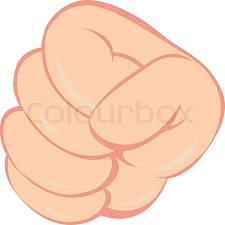
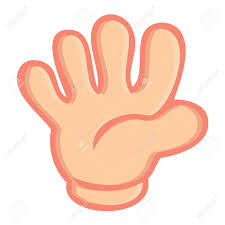
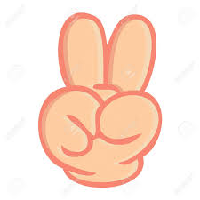

# Rock-Paper-Scissors-game.
Made using HTML, CSS and JavaScript.
<!--HTML code-->
<!DOCTYPE html>
<html>
<head>
    <title>Rock Paper Scissors Game</title>
    
    <link rel="stylesheet" type="text/css" href="rps.css">
    </head>
<body>
    <header>
    <h1> Rock Paper Scissors</h1>
    </header>
   <marquee direction="right" behavior="alternate" >Game On! </marquee>
    

    
user

    
comp

        0 :
        0
    
    

   
    

        
Paper covers rock, you win!

    
    

    

       

        

        

        

        
    
    
    

    
   <marquee direction="left" behavior="alternate">  
    
Make your choice.

    
    </marquee>
    
    
    
    
    </body>

</html>

<!--CSS code starts here-->

@import url('https://fonts.googleapis.com/css?family=Germania+One');

*{
    margin:0;
    padding:0;

    
    
}

header{
    background-color: white;
    
}
header > h1{
    font-family: germania one;
    text-align: center;
    margin:0px;
    font-size:50px;
}

body{
    
    background-color: dimgrey;
}
.score-board{
    margin: 20px 200px;
    text-align: center;
    border: 3px solid white;
    padding: 10px 10px;
    font-family: germania one;
    position:relative;
}

.result{
    
    font-family: germania one;
    text-align: center;
    font-size: 20px;
    color: white;
    
}
.badge{
    background-color: brown;
    margin: 0px 30px;
    
    }
#user-lable{
    position:absolute;
    left:-50px;
    top:10px;
    
}

#computer-lable{
    position:absolute;
    right:-50px;
    
    
}
marquee{
    font-size: 30px;
    font-family: germania one;
    color= 
    
}
.choices{
    text-align: center;
    margin-top:0px;
    padding: 30px;
    position: sticky;
}

.choice{
    display: inline-block;
    border-radius: 70px;
    padding: 30px;
    border:3px solid;
    
}

.choice:hover{
    cursor: pointer;
    background-color: white;
    
    
}
.select{
    font-size: 20px;
    text-align: center;
    font-family: germania one;
    
}
.green-glow{
    border:3px solid #4dcc7d;
    box-shadow: 0 0 10px #31b431;
    
    
}
.red-glow{
    
    border: 3px solid #fc121b;
    box-shadow: 0 0 10px #d01115;
}
.grey-glow{
    
    border: 3px solid #464647;
    box-shadow: 0 0 10px #25292b;
}

<!--JavaScript code starts here-->
<!--JavaScript code starts here-->
let userScore = 0;
let computerScore = 0;
const userScore_span = document.getElementById("user-score");
const computerScore_span = document.getElementById("computer-score");
const scoreBoard_div = document.querySelector("score-board");
const result_p = document.querySelector(".result>p");
const rock_div = document.getElementById("r");
const paper_div = document.getElementById("p");
const scissors_div = document.getElementById("s");

function getComputerChoice(){
    
    const choices = ['r', 'p', 's'];
    const randomNumber = (Math.floor(Math.random()*3));
    return choices[randomNumber];
}

function convert(letter){
    if (letter == "r") return "Rock";
    if (letter == "p") return "Paper";
    return "Scissors";
}

function win(userChoice, computerChoice){
    userScore++;
    userScore_span.innerHTML = userScore;
    computerScore_span.innerHTML = computerScore; 
   const smallUserWord = "user".fontsize(3).sub();
    const smallComputerWord = "computer".fontsize(3).sub();
    
    result_p.innerHTML = `${convert(userChoice)}${smallUserWord} beats ${convert(computerChoice)}${smallComputerWord} , You Win!`;
    document.getElementById(userChoice).classList.add('green-glow');
    setTimeout(function() {document.getElementById(userChoice).classList.remove('green-glow')}, 500);
}
function lose(userChoice, computerChoice){
    computerScore++;
     userScore_span.innerHTML = userScore;
    computerScore_span.innerHTML = computerScore; 
   const smallUserWord = "user".fontsize(3).sub();
    const smallComputerWord = "computer".fontsize(3).sub();
    
    result_p.innerHTML = `${convert(userChoice)}${smallUserWord} loses to ${convert(computerChoice)}${smallComputerWord} , You Lost...`; 
     document.getElementById(userChoice).classList.add('red-glow');
    setTimeout(function() {document.getElementById(userChoice).classList.remove('red-glow')}, 500);
    
}
function tie(userChoice, computerChoice){
      userScore_span.innerHTML = userScore;
    computerScore_span.innerHTML = computerScore; 
   const smallUserWord = "user".fontsize(3).sub();
    const smallComputerWord = "computer".fontsize(3).sub();
    
    result_p.innerHTML = `${convert(userChoice)}${smallUserWord} equals ${convert(computerChoice)}${smallComputerWord} , It's a tie.`; 
     document.getElementById(userChoice).classList.add('grey-glow');
    setTimeout(function() {document.getElementById(userChoice).classList.remove('grey-glow')}, 500);
}

function game(userChoice){
        const computerChoice = getComputerChoice();
   switch (userChoice + computerChoice)
       {
           case "rs":
           case "pr":
           case "sp":
               win(userChoice,computerChoice);
               break;
           case "rp":
           case "ps":
           case "sr":
               lose(userChoice, computerChoice);
               break;
           case "rr":
           case "pp":
           case "ss":
               tie(userChoice, computerChoice);
               break;
               
               
       }
    
    
}

function main(){    rock_div.addEventListener('click', function(){
              game("r");})            
       
paper_div.addEventListener('click', function(){
                          game("p");})
        
scissors_div.addEventListener('click', function(){
                          game("s");})
               }
 main();

